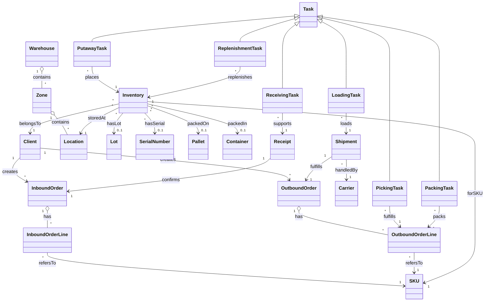

# 结构图

下面用 Mermaid 表达 3PL 仓储案例包的核心类与关系。

## 类图

```mermaid
classDiagram
    class Client
    class Warehouse
    class Zone
    class Location
    class SKU
    class Inventory
    class Lot
    class SerialNumber
    class Pallet
    class Container
    class InboundOrder
    class OutboundOrder
    class InboundOrderLine
    class OutboundOrderLine
    class Receipt
    class Shipment
    class Carrier
    class Task
    class ReceivingTask
    class PutawayTask
    class PickingTask
    class PackingTask
    class LoadingTask
    class ReplenishmentTask

    Task <|-- ReceivingTask
    Task <|-- PutawayTask
    Task <|-- PickingTask
    Task <|-- PackingTask
    Task <|-- LoadingTask
    Task <|-- ReplenishmentTask

    Warehouse "1" o-- "*" Zone : contains
    Zone "1" o-- "*" Location : contains
    Client "1" --> "*" InboundOrder : creates
    Client "1" --> "*" OutboundOrder : creates
    InboundOrder "1" o-- "*" InboundOrderLine : has
    OutboundOrder "1" o-- "*" OutboundOrderLine : has
    InboundOrderLine "*" --> "1" SKU : refersTo
    OutboundOrderLine "*" --> "1" SKU : refersTo
    Inventory "*" --> "1" Client : belongsTo
    Inventory "*" --> "1" Location : storedAt
    Inventory "*" --> "1" SKU : forSKU
    Inventory "*" --> "0..1" Lot : hasLot
    Inventory "*" --> "0..1" SerialNumber : hasSerial
    Inventory "*" --> "0..1" Pallet : packedOn
    Inventory "*" --> "0..1" Container : packedIn
    Receipt "1" --> "1" InboundOrder : confirms
    Shipment "1" --> "1" OutboundOrder : fulfills
    Shipment "*" --> "1" Carrier : handledBy
    ReceivingTask "*" --> "1" Receipt : supports
    PutawayTask "*" --> "1" Inventory : places
    PickingTask "*" --> "1" OutboundOrderLine : fulfills
    PackingTask "*" --> "1" OutboundOrderLine : packs
    LoadingTask "*" --> "1" Shipment : loads
    ReplenishmentTask "*" --> "1" Inventory : replenishes
```

## 读图说明

- `Client` 是业务发起方
- `Order` 是业务请求
- `Receipt` 和 `Shipment` 是执行结果
- `Task` 是作业动作
- `Inventory` 是仓内状态的核心实体

